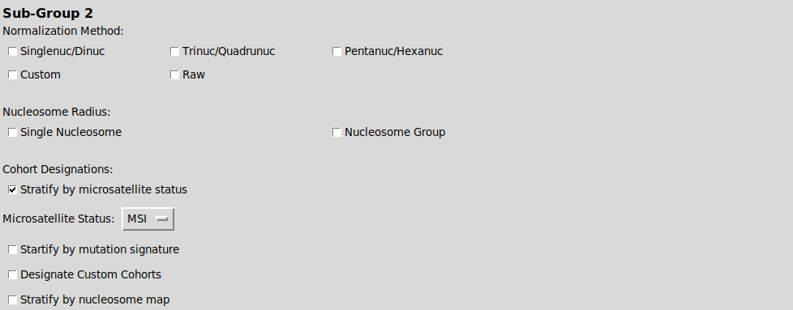
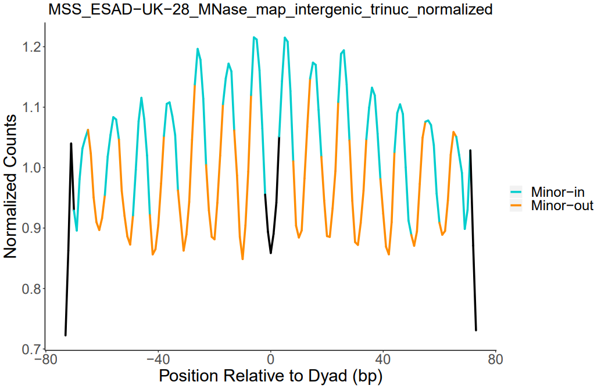
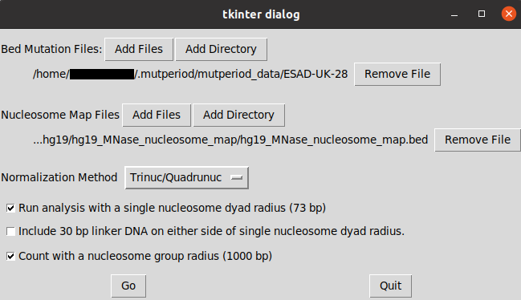
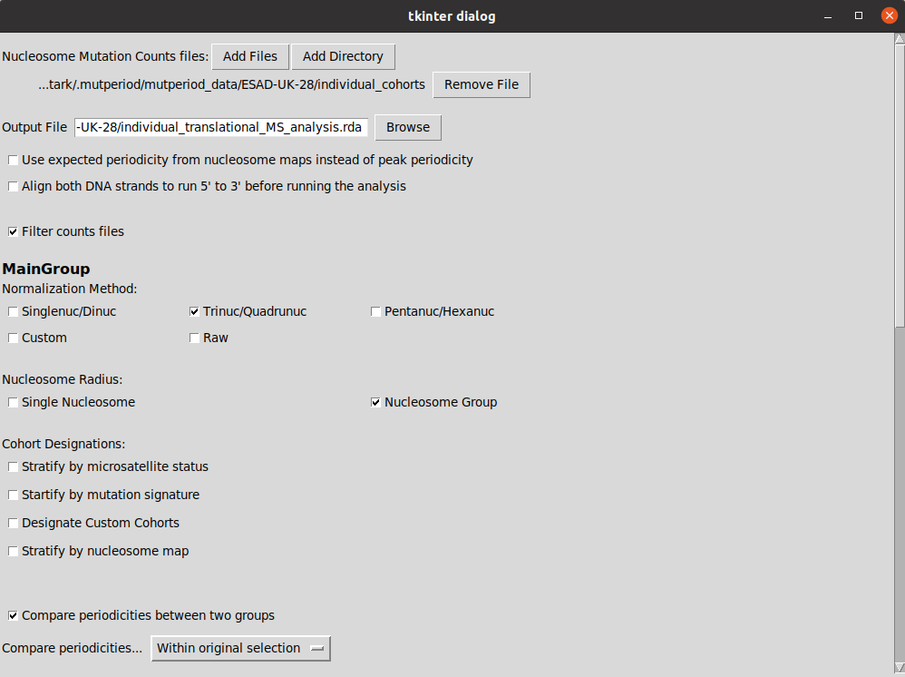
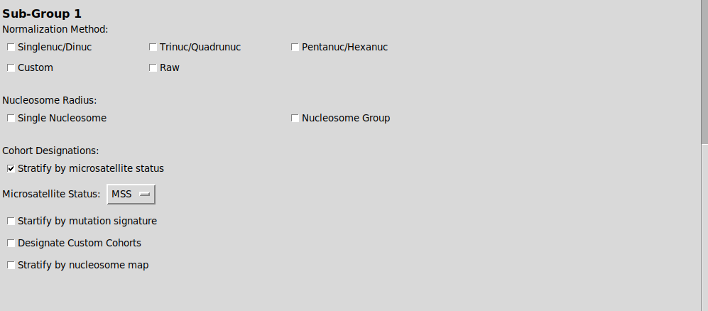
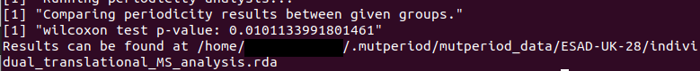

# mutperiod
##### A hybrid Python and R toolset for characterizing nucleosome mutational periodicities.
***
## Table of Contents
1. [Quickstart Guide](#quickstart-guide)
2. [Installation Guide](#installation-guide)
3. [Input Files and Formats](#input-files-and-formats)
4. [The Primary Data Pipeline](#the-primary-data-pipeline)
5. [Quantifying the Periodicity](#quantifying-the-periodicity)
6. [Interpreting Results](#interpreting-results)
7. [A Representative Example](#a-representative-example)
8. [Acknowledgements](#acknowledgements)
***
## Quickstart Guide
#### 1. Install mutperiod 
Install mutperiod through apt using the following two commands (available on Ubuntu version 20.04, Focal Fossa):  
  `sudo add-apt-repository ppa:ben-morledge-hampton/mutperiod`  
  `sudo apt update`  
  `sudo apt install mutperiod`  

#### 2. Set up the Data Directory
After installing, run the following command:  
  `mutperiod parseICGC`  
This should open up a dialog to choose a directory to store data files in.  Choose a directory.  After choosing a directory, you should quit out of the following dialog to obtain the necessary data to run your analysis  

#### 3. Obtain Genome and Nucleosome Positioning Data
From the following link, download the zipped hg19 directory:  
<https://notAValidLinkYet.com>  
Navigate to the directory you chose in step 2 and unzip the contents of the hg19 file into the "mutperiod_data/\_\_external_data" directory.  

*Note:  Alternatively, you may use a different genome or nucleosome positioning file, but you must make sure the latter is formatted correctly, as detailed in [Section 3](#input-files-and-formats)*

#### 4. Obtain Mutation Data
Go to the [ICGC data portal](https://dcc.icgc.org/releases) to obtain mutation data for use in mutperiod.  Download any "simple_somatic_mutation" file with whole genome sequencing data.  Place the gzipped file into a new directory (other than the "\_\_external_data" directory) within the "mutperiod_data" directory.  
*Careful:  mutperiod only maps mutations originating from whole genome sequencing data.  Exome sequencing data will not be carried through the pipeline, potentially resulting in blank output files.*  

*Note:  Alternatively, you may use any bed formatted mutation data for analysis, but you must may need to alter the data format slightly to be recognized by mutperiod as a CustomBed formatted file, as detailed in [Section 3](#input-files-and-formats)*

#### 5. Parse Input Data
If using data from ICGC, run the following command:  
  `mutperiod parseICGC`  
Otherwise, if you are using custom bed input, run this command:  
  `mutperiod parseBed`  
Fill out the resulting dialogs using the files obtained in steps 3 and 4.

#### 6. Perform Periodicity Analysis
Run the following command:
  `mutperiod mainPipeline`  
Select the directory you created within the "mutperiod_data" directory in step 4.  Select the desired normalization method and search radius.  

After main pipeline has finished running, run this next command:  
  `mutperiod periodicityAnalysis`  
Once again, select the directory you created to find the nucleosome mutation counts files.  Select an output file to store the results of the analysis.  In the "Main Group" portion of the dialog, select the normalization and radius options that you used when running the main pipeline.  All other options may be left unaltered.

*Note:  Both .rda and .tsv formats are supported as output, but only the .rda format supports figure generation in the next step.*

#### 7. Visualizing Results
To visualize results, run the following command:  
  `mutperiod generateFigures`  
Select the files you want to visualize and the output format for the figure(s).  

#### 8. Other Features
Mutperiod also supports stratification of input data by various conditions and comparison of the periodicities of each of the resulting cohorts.  For more information, see the sections below.

***
## Installation Guide
Easy installation of mutperiod can occur through the ppa at <https://launchpad.net/~ben-morledge-hampton/+archive/ubuntu/mutperiod>  
To install through this ppa, run the following commands:  
  `sudo add-apt-repository ppa:ben-morledge-hampton/mutperiod`  
  `sudo apt update`  
  `sudo apt install mutperiod`  

Currently, this installation method for mutperiod is only available on Ubuntu version 20.04, Focal Fossa, due to a dependency on a Python install of at least version 3.7.  However, installation on other linux distributions is certainly possible through manual installation of the Python and R packages provided in this repository.  If you believe a specific linux distribution should be supported by the ppa, but isn't, please contact me at b.morledge-hampton@wsu.edu

***
## Input Files and Formats
#### Directory Structure
All data files should be stored within the mutperiod_data directory.  

Genome data should be stored in the "\_\_external_data" directory under a sub-directory with the same name as the corresponding genome fasta file.  (e.g. "hg19.fa" should be stored in the "mutperiod_data\\\_\_external_data\\hg19" directory.)  

Nucleosome positioning data should be stored in a sub-directory under the corresponding genome directory and should be named after the corresponding nucleosome positioning file.  (e.g. "MNase_nuc_pos.bed" should be stored in the "mutperiod_data\\\_\_external_data\\hg19\\MNase_nuc_pos" directory.)  

Each individual mutation input file should be stored in its own directory under the "mutperiod_data" directory.  Nested directories are allowed.  mutperiod populates these directories with all other files generated during the analysis.  

#### Genome Data
All genome information should be given in standard fasta format with chromosome identifiers as headers.

#### Nucleosome Positioning Data
All nucleosome positioning data should be in bed format.  Only the first three columns, containing the chromosome identifiers, 0-based start positions, and 1-based start positions are used.  Other columns may be included after these first three, but they will be ignored.

#### Mutation Data
mutperiod supports two primary input formats for mutation data:  
First, data downloaded directly from the [ICGC data portal](https://dcc.icgc.org/releases) can be easily parsed using the following terminal command:  
  `mutperiod parseICGC`  

Data from any other format should be converted to the specialized bed format recognized by mutperiod and parsed using the command:  
  `mutperiod parseBed`  
This format is a variation on the standardized bed format and contains 6-7 tab separated data columns (with the 7th being optional).  The columns should be formatted as follows:  
##### Column 1
- Chromosome identifier.  (e.g. "chr1")  
- Should match the identifiers used in the corresponding genome fasta file.
##### Column 2
- 0 based mutation start position
##### Column 3
- 1 based mutation end position
##### Column 4
- The base(s) in the reference genome at this position.  
- If set to ".", the base(s) will be auto-acquired using the genome fasta file.  
- Use the "\*" character to indicate an insertion between the two bases given in columns 2 and 3.  
##### Column 5
- The base(s) that the position(s) were mutated to.  
- Use the "\*" character indicates a deletion of the base(s) given in columns 2 and 3  
- Use the string "OTHER" to indicate any other lesion or feature  
##### Column 6
- The strand the mutation/alteration occurred in.  
- Single-base substitution mutations are flipped if necessary so that they occur in the pyrimidine-containing strand.  
- If set to ".", the strand is determined from the genome file, if possible (not an insertion).
##### Column 7
- The chort the tumor belongs to.  e.g. a donor ID or tumor type.  
- This column is technically optional but is required for stratifying data in future steps.  
- If any cohort designations are given, ALL entries must have designations.  
- Use the "." character in this column to used to avoid assigning an entry to another cohort without breaking the above rule.

#### Example Bed Mutation Data

#### Stratifying Mutation Data
With either of the above input formats, mutations can stratified in a number of different ways:   
- For ICGC data, mutations are first stratified by the donor ID's present in the original input data.  
- For custom bed data, the 7th column, if present, contains identifiers to similarly stratify mutations into user-specified cohorts.  
- Beyond this initial stratification, mutperiod uses the MSIseq and deconstructSigs R packages to support stratification of cohorts by microsatellite stability or dominant mutation signature.  Both stratification options are selectable through the dialogues used to specify input data.  

***
## The Primary Data Pipeline
In order to prepare mutation data for nucleosome periodicity analysis, several key data processing events have to occur.  These events are all managed through one terminal command:  
  `mutperiod mainPipeline`  

This main pipeline incorporates three key data processing steps:
#### 1. Expansion of Mutation Context
If you choose to normalize mutation data by the surrounding DNA context, the given mutation data needs to be expanded.  Base positions are expanded as necessary and the genome fasta file is used to generate the surrounding trinucleotide, pentanucleotide, etc. context as requested.

#### 2. Counting Mutations Relative to Dyad Centers.
You will have to choose a dyad radius to count mutations in.  Typically, this is either 73 bp (for rotational periodicity within a single nucleosome) or 1000 bp (for translational periodicity across multiple nucleosomes).  Using a selected nucleosome positioning file, mutations are counted in each radius and their positions relative to the dyad center are recorded.  

#### 3.  Normalizing mutation counts
There are several options for normalizing mutation counts, if desired.  The simplest options involve using the surrounding nucleotide context to normalize data.  The average mutation rate for each nucleotide context is calculated across the entire genome, and a background mutation rate for each dyad position is calculated by multiplying each context's mutation rate by that context's frequency at the given position and summing the results across all contexts.  Alternatively, background mutation rates can be supplied manually by the user or even from another mutperiod data set's nucleosome mutation counts.  Normalized mutation rates are calculated by dividing the observed mutation rates at each dyad position by the background mutation rates.  

***
## Quantifying the Periodicity
Once mutation counts at each dyad position have been obtained, the data is passed to the R portion of mutperiod to quantify the periodicity.  
This is achieved with the command:  
  `mutperiod periodicityAnalysis`  
  
A Lomb-Scargle periodogram is used to find the periodicity with the highest power.  
- For data counted in a single nucleosome radius (73 bp), periodicities are examined between 7 and 20.
- For data counted in a radius encompassing several nucleosomes (1000 bp), periodicities are examined between 50 and 250.  
- In both of the above cases, an oversampling factor of 100 is used.  

Once the maximum power periodicity has been found, a signal-to-noise ratio is obtained by dividing the maximum power by the median of all powers not within 0.5 units of the maximum power peak.  

If multiple files containing nucleosome mutation counts are submitted for analysis, the files can be stratified into two groups to determine if the mean SNR is significantly different between them.  This comparison occurs using a Wilcoxon Rank Sum Test.  The dialog created by invoking the above command (shown below) allows you to form two separate groups by filtering on characteristics like normalization method, nucleosome radius, and cohort designations.  In addition, the main group can be filtered as well for convenience.  Filtering of the two groups for comparison occurs *after* the main group is filtered, so filtering options from the main group do not need to be used in the comparison groups.  Leaving any group of filter options empty (e.g. all normalization methods) causes filtering to not be applied for that option.  If custom cohorts need to be designated, this should be done using a plain text file with each cohort designation given on a separate line of the file.  An example of this dialog is given in the image below:  

The results of the periodicity analysis can be stored as either a .rda or .tsv formatted file.  However, please note that the .rda format is preferred when generating figures using mutperiod and that the .tsv format does not preserve the results of the Wilcoxon Rank Sum Test.  

*Note:  By default, any nucleosome mutation counts file with less than 5,000 raw mutations is removed from the analysis.  Historically, data with less than 5,000 mutations mapped to nucleosomes are much less likely to contain a noticeable periodicity.*  

***
## Interpreting Results

When inteprpreting results from mutperiod, it is best to keep a few key considerations in mind:  
1. It is expected that pronounced single nucleosome and nucleosome group periodicities have periods of 10.2 bp and ~190 bp respectively.  These values correspond to the geometry of DNA and the average spacing of nucleosomes.  
2. mutperiod has the most predictive power when used to compare results across two data sets, as described above.  By themselves, the SNR values are somewhat arbitrary since they are dependent on the range and resolution of periodicities tested using the Lomb-Scargle periodogram.  

For a clear visual representation of the periodicities in your data, consider using the following command:  
  `mutperiod generateFigures`  
As the name implies, this command generates figures showing mutation counts across the dyad radius and color-coding the regions that are expected to cause the periodicity.  Several options allow the fine tuning of these figures:  
- Outliers can be omitted to clean up the graphs.  
- Data spanning multiple nucleosomes can be smoothed to suppress the periodicity that may be present within individual nucleosomes.  
- The results can be "strand aligned" meaning that the dyad position for mutation counts on the minus strand of DNA are inverted, causing both strands to be aligned 5' to 3'.  

An example of one of these figures is given here:  

***
## A Representative Example

#### Obtaining the data
The mutation data used in this example comes from the [ICGC data portal](https://dcc.icgc.org/releases).  
The genome fasta file and nucleosome positioning files used can be found [here](<https://notAValidLinkYet.com>).  

#### Parsing the input data
The following mutperiod command was used to parse the data:  
  `mutperiod parseICGC`  
The dialog was filled out as follows to parse the data and generate individual donors, stratified by microsatellite stability:  

#### Processing the data for periodicity analysis
The following mutperiod command was used to prepare the data for periodicity analysis:  
  `mutperiod mainPipeline`  
The dialog was filled out as follows to normalize data by trinucleotide context and count mutations within both single nucleotide and nucleotide group radii.  

#### Quantifying the periodicity
The following mutperiod command was used to prepare the data for periodicity analysis:  
  `mutperiod periodicityAnalysis`  
The dialog was filled out as follows to quantify the periodicities of the grouped MSS and MSI data.  

In addition, the command was run again and the dialog was filled out as follows to compare the translational periodicities of MSS vs MSI cohorts.  
  

The Wilcoxon Rank Sum test produced the following results:  

#### Visualizing the results
The following mutperiod command was used to order to visualize the results:  
  `mutperiod generateFigures`  
The dialog was filled out as follows to view graphs of the normalized and grouped MSS and MSI data with results smoothed to suppress the individual nucleosome periodicity in the nucleosome group data.  

Here is an example of one of the resulting figures:  

***
## Acknowledgements
I would like to thank the following individuals and organizations who made developing mutperiod possible:  
- The Wyrick lab at Washington State University, especially Dr. John Wyrick, who guided me through much of this process.  
- Washington State University for funding me as a graduate student while I developed mutperiod.  
- Dr. Pete Tucker who taught me to be flexible, creative, persistent, and confident as I steadily work to become a better programmer and student.  
- T.B. for their heartfelt support throughout the development cycle of mutperiod.
